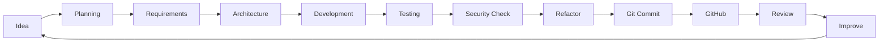
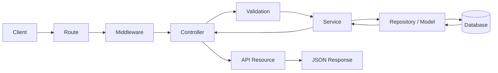

<div align="center">


# Hi, I'm Aulia Raditama

### Full Stack Developer • Backend Enthusiast • Indie Game Developer

<p>
  Building structured web applications, maintainable backend systems,
  REST APIs, and experimental game projects.
</p>


<br>
<br>

<a href="https://github.com/auliaraditama-dev">
  
</a>


<br>
<br>


<br>
<br>

<a href="#about-me">About</a>
  •   <a href="#what-i-do">What I Do</a>
  •   <a href="#tech-stack">Tech Stack</a>
  •   <a href="#currently-learning">Learning</a>
  •   <a href="#github-statistics">Statistics</a>
  •   <a href="#connect-with-me">Connect</a>

</div>

---

# About Me

```php
<?php

$developer = [
    'name' => 'Aulia Raditama',

    'role' => [
        'Full Stack Developer',
        'Backend Enthusiast',
        'Indie Game Developer',
    ],

    'focus' => [
        'Backend Development',
        'Laravel',
        'REST API',
        'Clean Architecture',
        'Database Design',
        'Game Development',
    ],

    'languages' => [
        'PHP',
        'JavaScript',
        'Python',
        'GDScript',
    ],

    'framework' => 'Laravel',

    'game_engine' => 'Godot 4',

    'database' => [
        'MySQL',
        'SQLite',
    ],

    'architecture' => [
        'MVC',
        'Service Layer',
        'Repository Pattern',
        'SOLID',
        'Design Patterns',
    ],

    'editor' => 'Visual Studio Code',

    'os' => [
        'Windows',
        'Linux',
    ],

    'motto' => 'Code. Create. Learn. Repeat.',
];
```

Saya tertarik pada pengembangan aplikasi yang tidak hanya **berjalan**, tetapi juga memiliki struktur yang jelas, mudah dikembangkan, aman, dan dapat dipelihara dalam jangka panjang.

Fokus utama saya berada pada pengembangan **web full-stack**, terutama sisi backend menggunakan **PHP dan Laravel**, pembangunan **REST API**, pengelolaan database, serta penerapan prinsip arsitektur perangkat lunak yang lebih terstruktur.

Di luar web development, saya juga mempelajari **game development menggunakan Godot 4 dan GDScript**, terutama gameplay system, state management, scene architecture, UI, particle system, dan pengembangan game 2D.

---

# Current Direction

<div align="center">

<table>
<tr>

<td width="25%" align="center" valign="top">

### Backend

Laravel
REST API
Authentication
Authorization
Security

</td>

<td width="25%" align="center" valign="top">

### Architecture

Clean Code
SOLID
MVC
Service Layer
Repository Pattern

</td>

<td width="25%" align="center" valign="top">

### Database

MySQL
SQLite
Relational Design
Query Optimization
Data Integrity

</td>

<td width="25%" align="center" valign="top">

### Game Dev

Godot 4
GDScript
Gameplay
Game UI
2D Systems

</td>

</tr>
</table>

</div>

---

# What I Do

<table>
<tr>

<td width="50%" valign="top">

## Full Stack Web Development

Mengembangkan aplikasi web dengan fokus pada:

* Struktur aplikasi yang scalable
* Backend yang terorganisir
* REST API
* Authentication
* Authorization
* Validation
* Database Design
* Query Optimization
* Application Security
* Responsive Interface
* Integrasi frontend dan backend
* Maintainable Code

### Main Stack

`PHP` · `Laravel` · `JavaScript` · `HTML5` · `CSS3` · `Bootstrap` · `MySQL`

</td>

<td width="50%" valign="top">

## Indie Game Development

Mengembangkan dan mempelajari sistem game menggunakan:

* Godot Engine
* GDScript
* Gameplay Mechanics
* Character Controller
* State Machine
* Scene Architecture
* Game State Management
* 2D Game Systems
* Particle Systems
* Game UI
* Save System
* Narrative Design
* Level Design

### Main Stack

`Godot 4` · `GDScript` · `2D` · `Gameplay Programming` · `Game Design`

</td>

</tr>
</table>

---

# Development Principles

<table>
<tr>

<td align="center" width="25%" valign="top">

### Clean Code

Kode harus mudah dibaca, dipahami, diuji, dan dikembangkan.

</td>

<td align="center" width="25%" valign="top">

### Architecture

Setiap bagian aplikasi harus memiliki tanggung jawab yang jelas.

</td>

<td align="center" width="25%" valign="top">

### Security

Keamanan harus menjadi bagian dari desain aplikasi sejak awal.

</td>

<td align="center" width="25%" valign="top">

### Continuous Learning

Setiap project menjadi kesempatan untuk memperbaiki cara membangun software.

</td>

</tr>
</table>

---

# Tech Stack

## Programming Languages

<p align="left">


</p>

## Frameworks & Libraries

<p align="left">


</p>

## Backend Development

<p align="left">


</p>

## Database

<p align="left">


</p>

## Game Development

<p align="left">


</p>

## Development Tools

<p align="left">


</p>

## Operating Systems

<p align="left">


</p>

---

# Skill Overview

<table>

<tr>
<td><strong>Backend</strong></td>
<td>PHP, Laravel, REST API, Validation, Authentication, Authorization</td>
</tr>

<tr>
<td><strong>Frontend</strong></td>
<td>HTML5, CSS3, JavaScript, Bootstrap, Responsive UI</td>
</tr>

<tr>
<td><strong>Database</strong></td>
<td>MySQL, SQLite, Relational Design, Query Optimization</td>
</tr>

<tr>
<td><strong>Architecture</strong></td>
<td>MVC, SOLID, Service Layer, Repository Pattern, Design Patterns</td>
</tr>

<tr>
<td><strong>Security</strong></td>
<td>Input Validation, Authentication, Authorization, Secure Application Design</td>
</tr>

<tr>
<td><strong>API</strong></td>
<td>REST API, JSON, HTTP, Validation, Error Handling</td>
</tr>

<tr>
<td><strong>Game Development</strong></td>
<td>Godot Engine, GDScript, Gameplay Systems, Scene Architecture, Game UI</td>
</tr>

<tr>
<td><strong>Version Control</strong></td>
<td>Git, GitHub, GitHub Desktop</td>
</tr>

<tr>
<td><strong>Environment</strong></td>
<td>Windows, Linux, Visual Studio Code</td>
</tr>

</table>

---

# Architecture & Engineering Focus

```text
Application
│
├── Presentation Layer
│   ├── Routes
│   ├── Controllers
│   ├── Requests
│   └── API Resources
│
├── Application Layer
│   ├── Services
│   ├── DTO
│   ├── Use Cases
│   └── Validation
│
├── Domain / Business Logic
│   ├── Rules
│   ├── Entities
│   └── Business Processes
│
├── Data Layer
│   ├── Models
│   ├── Repositories
│   ├── Queries
│   └── Database
│
└── Infrastructure
    ├── Authentication
    ├── Authorization
    ├── Queue
    ├── Events
    ├── Logging
    └── External Services
```

Prinsip yang ingin saya terapkan:

`Separation of Concerns` · `SOLID` · `Dependency Injection` · `Reusable Components` · `Secure Defaults` · `Maintainability`

---

# Currently Learning

<table>
<tr>

<td width="33%" valign="top">

## Advanced Laravel

* Advanced REST API
* Authentication
* Authorization
* Policies
* Middleware
* Form Request
* API Resource
* Service Layer
* Repository Pattern
* Queue & Jobs
* Events & Listeners
* Database Optimization
* API Security
* Testing

</td>

<td width="33%" valign="top">

## Clean Architecture

* SOLID Principles
* Separation of Concerns
* Dependency Injection
* Repository Pattern
* Service Pattern
* DTO
* Domain Logic
* Design Patterns
* Maintainable Code
* Scalable Architecture
* Refactoring
* Testing Strategy

</td>

<td width="33%" valign="top">

## Godot 4

* GDScript
* Scene Architecture
* Nodes & Signals
* State Machine
* Character Controller
* Game UI
* Particle System
* Save System
* Game State
* Narrative System
* Level Design
* Optimization

</td>

</tr>
</table>

---

# Learning Roadmap

```text
Full Stack Developer
│
├── Backend Engineering
│   ├── PHP
│   ├── Laravel
│   ├── REST API
│   ├── Authentication
│   ├── Authorization
│   ├── Validation
│   ├── Queue & Jobs
│   ├── Events & Listeners
│   ├── Database Optimization
│   ├── Application Security
│   └── Testing
│
├── Software Architecture
│   ├── Clean Code
│   ├── SOLID
│   ├── MVC
│   ├── Service Layer
│   ├── Repository Pattern
│   ├── Dependency Injection
│   ├── DTO
│   ├── Design Patterns
│   └── Clean Architecture
│
├── Frontend
│   ├── HTML5
│   ├── CSS3
│   ├── JavaScript
│   ├── Responsive Design
│   └── Bootstrap
│
├── Database
│   ├── MySQL
│   ├── SQLite
│   ├── Relational Design
│   ├── Indexing
│   ├── Query Optimization
│   └── Data Integrity
│
├── Development Workflow
│   ├── Git
│   ├── GitHub
│   ├── Branching
│   ├── Pull Requests
│   ├── Code Review
│   └── CI / Automation
│
└── Game Development
    ├── Godot Engine
    ├── GDScript
    ├── Scene Architecture
    ├── Gameplay Programming
    ├── State Machine
    ├── Game UI
    ├── Save System
    ├── Game Narrative
    ├── Level Design
    └── Optimization
```

---

# Current Focus

```text
01. Build cleaner Laravel applications
02. Improve REST API architecture
03. Learn advanced authentication and authorization
04. Improve database query performance
05. Apply SOLID principles consistently
06. Improve application security practices
07. Learn reusable software design patterns
08. Build scalable project structures
09. Improve Git and GitHub workflow
10. Learn automated testing
11. Master Godot 4 architecture
12. Build better projects every iteration
```

---

# How I Approach Development

```text
Problem
  │
  ▼
Requirement Analysis
  │
  ▼
Data & Domain Modeling
  │
  ▼
Architecture Planning
  │
  ▼
Implementation
  │
  ▼
Validation & Testing
  │
  ▼
Security Review
  │
  ▼
Refactoring
  │
  ▼
Documentation
  │
  ▼
Git Commit / Pull Request
  │
  ▼
Iteration & Improvement
```

---

# Featured Project Categories

<table>
<tr>

<td width="33%" align="center" valign="top">

## Web Applications

Structured full-stack applications focused on maintainability and backend architecture.

`Laravel`

`PHP`

`MySQL`

`JavaScript`

</td>

<td width="33%" align="center" valign="top">

## REST API

API-oriented projects with validation, authentication, authorization, and database integration.

`REST`

`JSON`

`Laravel`

`MySQL`

</td>

<td width="33%" align="center" valign="top">

## Game Projects

Experimental and learning-oriented game projects developed using Godot Engine.

`Godot 4`

`GDScript`

`2D`

`Game Dev`

</td>

</tr>
</table>

---

# Developer Mindset

<div align="center">

<table>
<tr>

<td width="25%" align="center">

### Build

Turn ideas into working systems.

</td>

<td width="25%" align="center">

### Understand

Learn how and why each component works.

</td>

<td width="25%" align="center">

### Refactor

Improve code when structure becomes unclear.

</td>

<td width="25%" align="center">

### Repeat

Use every project to improve the next one.

</td>

</tr>
</table>

</div>

---

# GitHub Statistics

<div align="center">


</div>

<br>

<div align="center">


</div>

---

# GitHub Profile Summary

<div align="center">


</div>

<br>

<div align="center">


</div>

<br>

<div align="center">


</div>

---

# GitHub Trophies

<div align="center">


</div>

---

# Activity Graph

<div align="center">


</div>

---

# Contribution Snake

<div align="center">

<picture>

<source
media="(prefers-color-scheme: dark)"
srcset="https://raw.githubusercontent.com/auliaraditama-dev/auliaraditama-dev/output/github-contribution-grid-snake-dark.svg"
/>

<source
media="(prefers-color-scheme: light)"
srcset="https://raw.githubusercontent.com/auliaraditama-dev/auliaraditama-dev/output/github-contribution-grid-snake.svg"
/>


</picture>

</div>

---

# Development Workflow



---

# Backend Request Flow



---

# Clean Architecture Goals

```text
Readable
   +
Testable
   +
Maintainable
   +
Secure
   +
Reusable
   +
Scalable
   =
Better Software
```

---

# My Coding Philosophy

> Simple code is easier to understand.
> Clean architecture is easier to maintain.
> Consistent learning creates better software.

Beberapa prinsip yang saya coba terapkan:

* Write code for humans first.
* Keep responsibilities separated.
* Avoid unnecessary complexity.
* Use meaningful naming.
* Validate data before processing it.
* Keep controllers focused.
* Move business logic into the correct layer.
* Keep database queries efficient.
* Handle errors intentionally.
* Keep security in mind from the beginning.
* Refactor when the structure becomes unclear.
* Write reusable components when appropriate.
* Use version control consistently.
* Document important technical decisions.
* Learn from every project.
* Build systems that are easier to maintain tomorrow than they are today.

---

# Development Checklist

```text
[✓] Clear project structure
[✓] Consistent naming
[✓] Separation of concerns
[✓] Input validation
[✓] Authentication
[✓] Authorization
[✓] Error handling
[✓] Database integrity
[✓] Query optimization
[✓] Security awareness
[✓] Git version control
[✓] Documentation
[✓] Refactoring
[✓] Continuous learning
```

---

# Beyond Code

<table>
<tr>

<td width="33%" align="center" valign="top">

## Coffee

A reliable companion during development sessions.

</td>

<td width="33%" align="center" valign="top">

## Lo-Fi

Background music for focused coding sessions.

</td>

<td width="33%" align="center" valign="top">

## Games

Interested in story-rich games, gameplay systems, and immersive game worlds.

</td>

</tr>
</table>

---

# Vibes & Inspiration

<div align="center">

<table>
<tr>

<td width="50%" align="center" valign="middle">

### Daily Developer Quote


</td>

<td width="50%" align="center" valign="middle">

### Developer Mode

```text
while (alive) {
    learn();
    code();
    create();
    test();
    refactor();
    improve();
}
```

</td>

</tr>
</table>

</div>

---

# Connect With Me

<div align="center">

<a href="https://www.instagram.com/auulaja_">
  
</a>

<a href="https://www.linkedin.com/in/aulia-raditama-0a11a9426/">
  
</a>

<a href="https://github.com/auliaraditama-dev">
  
</a>

<!--

Tambahkan Discord ketika URL tersedia.

<a href="YOUR_DISCORD_URL">
  
</a>

-->

<!--

Tambahkan Facebook ketika URL tersedia.

<a href="YOUR_FACEBOOK_URL">
  
</a>

-->

<!--

Tambahkan X ketika URL tersedia.

<a href="YOUR_X_URL">
  
</a>

-->

</div>

---

# Profile Summary

<div align="center">

```text
Name        : Aulia Raditama
Role        : Full Stack Developer
Focus       : Backend Development
Framework   : Laravel
Language    : PHP / JavaScript / Python / GDScript
Game Engine : Godot 4
Database    : MySQL / SQLite
Architecture: MVC / SOLID / Service Layer / Repository Pattern
Editor      : Visual Studio Code
Platform    : Windows / Linux
Learning    : Clean Architecture & Software Design Patterns
Motto       : Code. Create. Learn. Repeat.
```

</div>

---

# Developer Status

<div align="center">


</div>

---

<div align="center">


<br>
<br>

### Thanks for visiting my GitHub profile.

**Code. Create. Learn. Repeat.**

<br>


</div>
