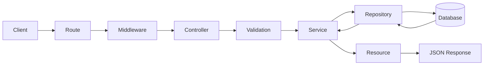
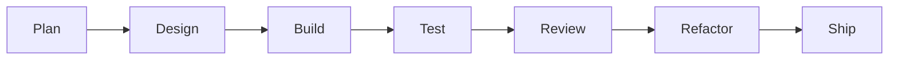

# Hi, I'm Aulia Raditama

### Full Stack Developer • Backend Enthusiast • Indie Game Developer

  

  

<a href="#about">About</a>
  •   <a href="#tech-stack">Tech Stack</a>
  •   <a href="#architecture">Architecture</a>
  •   <a href="#learning">Learning</a>
  •   <a href="#statistics">Statistics</a>
  •   <a href="#activity">Activity</a>
  •   <a href="#connect">Connect</a>

---

# About Me

<table width="100%">
<tr>

<td width="50%" valign="top">

### Developer

Full Stack Developer dengan fokus pada **backend development**, terutama:

</td>

<td width="50%" valign="top">

### Game Development

Mempelajari pengembangan game dan reusable gameplay systems menggunakan:

</td>

</tr>
</table>

---

## Developer Snapshot

<table width="100%">
<tr>

<td width="25%" valign="top">

**Main**

`Laravel`

</td>

<td width="25%" valign="top">

**Backend**

`REST API`

</td>

<td width="25%" valign="top">

**Database**

`MySQL`

</td>

<td width="25%" valign="top">

**Game Engine**

`Godot 4`

</td>

</tr>
</table>

---

# Tech Stack

<table width="100%">
<tr>

<td width="50%" valign="top">

### Languages

</td>

<td width="50%" valign="top">

### Frameworks & Backend

</td>

</tr>

<tr>

<td width="50%" valign="top">

### Architecture

</td>

<td width="50%" valign="top">

### Data & Game

</td>

</tr>

<tr>

<td colspan="2" valign="top">

### Development Tools

</td>

</tr>
</table>

---

# Architecture

### Backend Request Lifecycle

<table width="100%">
<tr>

<td width="50%" valign="top">

### Core Principles

</td>

<td width="50%" valign="top">

### Engineering Goals

</td>

</tr>
</table>

---

## Development Flow

---

# Currently Learning

<table width="100%">
<tr>

<td width="50%" valign="top">

### Backend Engineering

</td>

<td width="50%" valign="top">

### Architecture & Game Dev

</td>

</tr>
</table>

---

## Current Focus

<table width="100%">
<tr>

<td width="50%" valign="top">

</td>

<td width="50%" valign="top">

</td>

</tr>
</table>

---

# GitHub Statistics

<table width="100%">
<tr>

<td width="50%" valign="top">

</td>

<td width="50%" valign="top">

</td>

</tr>
</table>

---

# Profile Analytics

<table width="100%">
<tr>

<td width="50%" valign="top">

</td>

<td width="50%" valign="top">

</td>

</tr>

<tr>

<td width="50%" valign="top">

</td>

<td width="50%" valign="top">

</td>

</tr>
</table>

---

# Trophies & Activity

---

# Contribution Snake

---

# Vibes & Status

<table width="100%">
<tr>

<td width="55%" valign="middle">

</td>

<td width="45%" valign="middle">

### Developer Status

</td>

</tr>
</table>

---

# Connect With Me

<table width="100%">
<tr>

<td width="60%" valign="middle">

### Social

  

</td>

<td width="40%" align="right" valign="middle">

</td>

</tr>
</table>

---

### Code. Create. Learn. Repeat.

