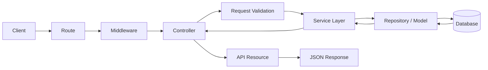
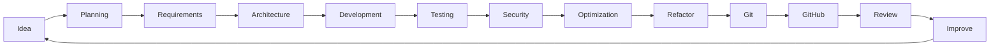

<div align="center">


# Hi, I'm Aulia Raditama

### Full Stack Developer • Backend Enthusiast • Indie Game Developer

<p>
Building structured web applications, maintainable backend systems,
REST APIs, databases, and experimental game projects.
</p>


<br>
<br>

<a href="https://github.com/auliaraditama-dev">
  
</a>


<br>
<br>


<br>
<br>

<a href="#about-me">About</a>
  •   <a href="#what-i-do">What I Do</a>
  •   <a href="#tech-stack">Tech Stack</a>
  •   <a href="#architecture--engineering">Architecture</a>
  •   <a href="#currently-learning">Learning</a>
  •   <a href="#github-statistics">Statistics</a>
  •   <a href="#connect-with-me">Connect</a>

</div>

---

# About Me

```php
<?php

$developer = [
    'name' => 'Aulia Raditama',

    'role' => [
        'Full Stack Developer',
        'Backend Enthusiast',
        'Indie Game Developer',
    ],

    'focus' => [
        'Backend Development',
        'Laravel',
        'REST API',
        'Clean Architecture',
        'Database Design',
        'Game Development',
    ],

    'languages' => [
        'PHP',
        'JavaScript',
        'Python',
        'GDScript',
    ],

    'framework' => 'Laravel',

    'game_engine' => 'Godot 4',

    'database' => [
        'MySQL',
        'SQLite',
    ],

    'architecture' => [
        'MVC',
        'SOLID',
        'Service Layer',
        'Repository Pattern',
        'Design Patterns',
    ],

    'tools' => [
        'Git',
        'GitHub',
        'Visual Studio Code',
    ],

    'platform' => [
        'Windows',
        'Linux',
    ],

    'motto' => 'Code. Create. Learn. Repeat.',
];
```

Saya tertarik pada pengembangan aplikasi yang tidak hanya **berjalan**, tetapi juga memiliki struktur yang jelas, aman, mudah dikembangkan, dan dapat dipelihara dalam jangka panjang.

Fokus utama saya berada pada pengembangan **web full-stack**, terutama backend menggunakan **PHP dan Laravel**, pembangunan **REST API**, pengelolaan database, authentication, authorization, serta penerapan prinsip arsitektur perangkat lunak yang terstruktur.

Di luar web development, saya juga mempelajari **game development menggunakan Godot 4 dan GDScript**, terutama gameplay systems, scene architecture, state machine, UI, particle systems, save system, narrative, dan pengembangan game 2D.

---

# Current Direction

<table>
<tr>

<td width="50%" valign="top">

### Backend Engineering

`Laravel`
`REST API`
`Authentication`
`Authorization`
`Validation`
`Application Security`

</td>

<td width="50%" valign="top">

### Software Architecture

`Clean Code`
`SOLID`
`MVC`
`Service Layer`
`Repository Pattern`
`Design Patterns`

</td>

</tr>

<tr>

<td width="50%" valign="top">

### Database Engineering

`MySQL`
`SQLite`
`Relational Design`
`Indexing`
`Query Optimization`
`Data Integrity`

</td>

<td width="50%" valign="top">

### Game Development

`Godot 4`
`GDScript`
`Gameplay Systems`
`State Machine`
`Game UI`
`2D Game Development`

</td>

</tr>
</table>

---

# What I Do

<table>
<tr>

<td width="50%" valign="top">

## Full Stack Development

Mengembangkan aplikasi web dengan fokus pada:

* Structured backend architecture
* REST API
* Authentication
* Authorization
* Request validation
* Error handling
* Database design
* Query optimization
* Application security
* Responsive frontend
* Frontend/backend integration
* Maintainable code

### Main Stack

`PHP` · `Laravel` · `JavaScript` · `HTML5` · `CSS3` · `Bootstrap` · `MySQL`

</td>

<td width="50%" valign="top">

## Indie Game Development

Mempelajari dan membangun sistem game menggunakan:

* Godot Engine
* GDScript
* Gameplay mechanics
* Character controller
* State machine
* Scene architecture
* Game state management
* 2D game systems
* Particle systems
* Game UI
* Save system
* Narrative design
* Level design

### Main Stack

`Godot 4` · `GDScript` · `2D` · `Gameplay Programming` · `Game Design`

</td>

</tr>
</table>

---

# Development Principles

<table>
<tr>

<td width="50%" valign="top">

### Clean Code

Kode harus mudah dibaca dan dipahami oleh developer lain maupun diri sendiri di masa depan.

</td>

<td width="50%" valign="top">

### Architecture

Setiap layer dan component harus memiliki responsibility yang jelas.

</td>

</tr>

<tr>

<td width="50%" valign="top">

### Security

Authentication, authorization, validation, dan data protection harus dipikirkan sejak awal.

</td>

<td width="50%" valign="top">

### Continuous Learning

Setiap project digunakan sebagai kesempatan untuk memperbaiki technical skill dan cara membangun software.

</td>

</tr>
</table>

---

# Tech Stack

## Programming Languages

<p align="center">


</p>

## Frameworks & UI

<p align="center">


</p>

## Backend

<p align="center">


</p>

## Database

<p align="center">


</p>

## Game Development

<p align="center">


</p>

## Development Tools

<p align="center">


</p>

## Operating Systems

<p align="center">


</p>

---

# Skill Overview

| Area                 | Technologies / Concepts                                  |
| -------------------- | -------------------------------------------------------- |
| **Backend**          | PHP, Laravel, REST API, Validation                       |
| **Authentication**   | Login Systems, Authentication, Sessions                  |
| **Authorization**    | Policies, Middleware, Role-based Access                  |
| **Frontend**         | HTML5, CSS3, JavaScript, Bootstrap                       |
| **Database**         | MySQL, SQLite, Relational Design                         |
| **Optimization**     | Query Optimization, Indexing                             |
| **Architecture**     | MVC, SOLID, Service Layer, Repository Pattern            |
| **API**              | REST, JSON, HTTP, API Resources                          |
| **Security**         | Validation, Authentication, Authorization, Secure Design |
| **Game Development** | Godot 4, GDScript, Gameplay Systems                      |
| **Version Control**  | Git, GitHub, GitHub Desktop                              |
| **Environment**      | Windows, Linux, Visual Studio Code                       |

---

# Architecture & Engineering

## Application Structure

```text
Application
│
├── Presentation Layer
│   ├── Routes
│   ├── Controllers
│   ├── Middleware
│   ├── Requests
│   └── API Resources
│
├── Application Layer
│   ├── Services
│   ├── DTO
│   ├── Use Cases
│   └── Validation
│
├── Domain Layer
│   ├── Business Rules
│   ├── Entities
│   ├── Contracts
│   └── Domain Logic
│
├── Data Layer
│   ├── Models
│   ├── Repositories
│   ├── Queries
│   └── Database
│
└── Infrastructure
    ├── Authentication
    ├── Authorization
    ├── Queue
    ├── Events
    ├── Logging
    ├── Cache
    └── External Services
```

### Engineering Principles

<div align="center">

`Separation of Concerns`
  •  
`SOLID`
  •  
`Dependency Injection`
  •  
`Reusable Components`

`Secure Defaults`
  •  
`Maintainability`
  •  
`Testability`
  •  
`Scalability`

</div>

---

# Backend Request Lifecycle



---

# Currently Learning

<table>
<tr>

<td width="50%" valign="top">

## Advanced Laravel

* Advanced REST API
* Authentication
* Authorization
* Policies
* Middleware
* Form Request
* API Resources
* Service Layer
* Repository Pattern
* Queue & Jobs
* Events & Listeners
* Database optimization
* API security
* Automated testing

</td>

<td width="50%" valign="top">

## Clean Architecture

* SOLID principles
* Separation of concerns
* Dependency injection
* Repository pattern
* Service pattern
* DTO
* Domain logic
* Design patterns
* Maintainable code
* Scalable architecture
* Refactoring
* Testing strategy

</td>

</tr>

<tr>

<td width="50%" valign="top">

## Database Engineering

* Relational design
* Indexing
* Query optimization
* Relationships
* Transactions
* Data integrity
* Database security
* Migration strategy
* Efficient querying
* Data modeling

</td>

<td width="50%" valign="top">

## Godot 4

* GDScript
* Scene architecture
* Nodes & signals
* State machine
* Character controller
* Game UI
* Particle system
* Save system
* Game state
* Narrative system
* Level design
* Optimization

</td>

</tr>
</table>

---

# Current Focus

```text
01. Build cleaner Laravel applications
02. Improve REST API architecture
03. Improve authentication & authorization
04. Improve database query performance
05. Apply SOLID principles consistently
06. Improve application security
07. Learn reusable software design patterns
08. Build scalable project structures
09. Improve Git & GitHub workflow
10. Learn automated testing
11. Explore GitHub Actions
12. Improve Godot 4 architecture
13. Build reusable gameplay systems
14. Build better projects every iteration
```

---

# How I Approach Development

```text
Idea / Problem
      │
      ▼
Requirement Analysis
      │
      ▼
Domain & Data Modeling
      │
      ▼
Architecture Planning
      │
      ▼
Implementation
      │
      ▼
Validation
      │
      ▼
Testing
      │
      ▼
Security Review
      │
      ▼
Optimization
      │
      ▼
Refactoring
      │
      ▼
Documentation
      │
      ▼
Git Commit / Pull Request
      │
      ▼
Review
      │
      ▼
Iteration & Improvement
```

---

# Development Workflow



---

# Featured Project Categories

<table>
<tr>

<td width="50%" valign="top">

## Web Applications

Full-stack applications dengan backend architecture yang terstruktur.

**Focus**

* Laravel
* PHP
* MySQL
* Authentication
* Authorization
* Responsive UI

</td>

<td width="50%" valign="top">

## REST API

API-oriented applications dengan validation, security, dan database integration.

**Focus**

* REST
* JSON
* Laravel
* MySQL
* Authentication
* API Resources

</td>

</tr>

<tr>

<td width="50%" valign="top">

## Backend Systems

Eksperimen backend dengan fokus pada struktur dan maintainability.

**Focus**

* Service Layer
* Repository Pattern
* SOLID
* Database Design
* Security

</td>

<td width="50%" valign="top">

## Game Projects

Experimental game projects dan learning projects menggunakan Godot Engine.

**Focus**

* Godot 4
* GDScript
* Gameplay
* 2D Systems
* Game Architecture

</td>

</tr>
</table>

---

# Developer Mindset

<table>
<tr>

<td width="50%" valign="top">

### Build

Turn ideas into working systems.

</td>

<td width="50%" valign="top">

### Understand

Understand how and why each component works.

</td>

</tr>

<tr>

<td width="50%" valign="top">

### Refactor

Improve code when responsibilities and structure become unclear.

</td>

<td width="50%" valign="top">

### Improve

Use every project as an opportunity to build the next project better.

</td>

</tr>
</table>

---

# GitHub Statistics

<div align="center">


</div>

<br>

<div align="center">


</div>

---

# GitHub Profile Summary

<div align="center">


<br>
<br>


<br>


</div>

---

# GitHub Trophies

<div align="center">


</div>

---

# Activity Graph

<div align="center">


</div>

---

# Dark Contribution Snake

<div align="center">


</div>

---

# Clean Architecture Goals

<div align="center">

```text
Readable
   +
Testable
   +
Maintainable
   +
Secure
   +
Reusable
   +
Scalable
   =
Better Software
```

</div>

---

# Development Checklist

```text
[✓] Clear project structure
[✓] Consistent naming
[✓] Separation of concerns
[✓] Request validation
[✓] Authentication
[✓] Authorization
[✓] Error handling
[✓] Database integrity
[✓] Query optimization
[✓] Security awareness
[✓] Git version control
[✓] Documentation
[✓] Refactoring
[✓] Continuous learning
```

---

# My Coding Philosophy

> Simple code is easier to understand.
> Clean architecture is easier to maintain.
> Consistent learning creates better software.

Prinsip yang saya coba terapkan:

* Write code for humans first.
* Keep responsibilities separated.
* Avoid unnecessary complexity.
* Use meaningful naming.
* Validate data before processing it.
* Keep controllers focused.
* Keep business logic in the correct layer.
* Keep database queries efficient.
* Handle errors intentionally.
* Keep security in mind from the beginning.
* Refactor when structure becomes unclear.
* Create reusable components when appropriate.
* Use version control consistently.
* Document important technical decisions.
* Learn from every project.
* Build systems that are easier to maintain tomorrow than today.

---

# Beyond Code

<table>
<tr>

<td width="50%" valign="top">

### Coffee

A reliable companion during development and debugging sessions.

</td>

<td width="50%" valign="top">

### Lo-Fi

Background music for focused coding and learning sessions.

</td>

</tr>

<tr>

<td width="50%" valign="top">

### Games

Interested in story-rich games, gameplay systems, and immersive game worlds.

</td>

<td width="50%" valign="top">

### Learning

Exploring new programming concepts and improving existing technical knowledge.

</td>

</tr>
</table>

---

# Vibes & Inspiration

<div align="center">


</div>

### Developer Mode

```javascript
const developer = {
    status: "learning",
    mindset: "continuous improvement"
};

while (developer.status === "learning") {
    learn();
    build();
    test();
    refactor();
    improve();
}
```

---

# Connect With Me

<div align="center">

<a href="https://www.instagram.com/auulaja_">
  
</a>

<a href="https://www.linkedin.com/in/aulia-raditama-0a11a9426/">
  
</a>

<a href="https://github.com/auliaraditama-dev">
  
</a>

<!--

DISCORD

<a href="YOUR_DISCORD_URL">
  
</a>

FACEBOOK

<a href="YOUR_FACEBOOK_URL">
  
</a>

X / TWITTER

<a href="YOUR_X_URL">
  
</a>

-->

</div>

---

# Profile Summary

<div align="center">

```text
Name         : Aulia Raditama
Role         : Full Stack Developer
Focus        : Backend Development
Framework    : Laravel
Languages    : PHP / JavaScript / Python / GDScript
Frontend     : HTML / CSS / JavaScript / Bootstrap
Game Engine  : Godot 4
Database     : MySQL / SQLite
Architecture : MVC / SOLID / Service Layer / Repository Pattern
Version Ctrl : Git / GitHub
Editor       : Visual Studio Code
Platform     : Windows / Linux
Learning     : Clean Architecture & Software Design Patterns
Motto        : Code. Create. Learn. Repeat.
```

</div>

---

# Developer Status

<div align="center">


</div>

---

<div align="center">


<br>
<br>

### Thanks for visiting my GitHub profile.

**Code. Create. Learn. Repeat.**

<br>


</div>
