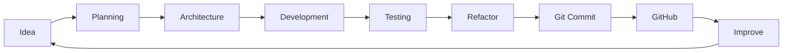

<div align="center">

# Hi, I'm Aulia Raditama

### Full Stack Developer • Backend Enthusiast • Indie Game Developer


<br>


<br>

<a href="https://github.com/auliaraditama-dev">
  
</a>


</div>

---

# About Me

```php
<?php

$developer = [
    'name'        => 'Aulia Raditama',
    'role'        => 'Full Stack Developer',
    'focus'       => [
        'Backend Development',
        'Laravel',
        'REST API',
        'Clean Architecture',
        'Game Development'
    ],
    'game_engine' => 'Godot Engine',
    'database'    => ['MySQL', 'SQLite'],
    'editor'      => 'Visual Studio Code',
    'os'          => ['Windows', 'Linux'],
    'motto'       => 'Code. Create. Learn. Repeat.',
];

```

Saya tertarik pada pengembangan aplikasi yang tidak hanya **berjalan**, tetapi juga memiliki struktur yang jelas, mudah dikembangkan, aman, dan dapat dipelihara dalam jangka panjang.

Fokus utama saya berada pada pengembangan **web full-stack**, khususnya backend menggunakan **PHP dan Laravel**, serta eksplorasi **game development menggunakan Godot Engine**.

---

# What I Do

<table>
  <tr>
    <td width="50%" valign="top">

### Full Stack Web Development

Membangun aplikasi web modern dengan fokus pada:

* Struktur aplikasi yang scalable
* Backend yang terorganisir
* REST API
* Authentication & Authorization
* Database Design
* Query Optimization
* Security
* Responsive UI
* Integrasi frontend dan backend

**Main Stack**

`PHP` · `Laravel` · `JavaScript` · `HTML` · `CSS` · `Bootstrap` · `MySQL`

</td>
<td width="50%" valign="top">

### Indie Game Development

Mengembangkan dan mempelajari game menggunakan:

* Godot Engine
* GDScript
* Gameplay Mechanics
* Game State Management
* 2D Game Systems
* Particle System
* UI Game
* Narrative Design
* Level Design

**Main Stack**

`Godot 4` · `GDScript` · `2D` · `Game Design`

</td>
  </tr>
</table>

---

# Development Principles

<table>
  <tr>
    <td align="center" width="25%">
      <h3>Clean Code</h3>
      <p>Kode harus mudah dibaca, dipahami, dan dikembangkan.</p>
    </td>
    <td align="center" width="25%">
      <h3>Architecture</h3>
      <p>Struktur aplikasi harus jelas dan memiliki separation of concerns.</p>
    </td>
    <td align="center" width="25%">
      <h3>Security</h3>
      <p>Keamanan menjadi bagian dari desain aplikasi, bukan tambahan.</p>
    </td>
    <td align="center" width="25%">
      <h3>Continuous Learning</h3>
      <p>Teknologi berkembang, sehingga proses belajar tidak berhenti.</p>
    </td>
  </tr>
</table>

---

# Tech Stack

## Programming Languages

<p align="left">


</p>

---

## Frameworks & Libraries

<p align="left">


</p>

---

## Game Development

<p align="left">


</p>

---

## Database

<p align="left">


</p>

---

## Development Tools

<p align="left">


</p>

---

## Operating Systems

<p align="left">


</p>

---

# Skill Overview

<table>
  <tr>
    <td><strong>Backend</strong></td>
    <td>PHP, Laravel, REST API, Authentication, Authorization</td>
  </tr>

  <tr>
    <td><strong>Frontend</strong></td>
    <td>HTML5, CSS3, JavaScript, Bootstrap</td>
  </tr>

  <tr>
    <td><strong>Database</strong></td>
    <td>MySQL, SQLite, Database Design, Query Optimization</td>
  </tr>

  <tr>
    <td><strong>Architecture</strong></td>
    <td>Clean Code, MVC, Service Layer, Repository Pattern, Design Patterns</td>
  </tr>

  <tr>
    <td><strong>Game Development</strong></td>
    <td>Godot Engine, GDScript, Gameplay Systems, Game Design</td>
  </tr>

  <tr>
    <td><strong>Version Control</strong></td>
    <td>Git, GitHub, GitHub Desktop</td>
  </tr>

  <tr>
    <td><strong>Environment</strong></td>
    <td>Windows, Linux, Visual Studio Code</td>
  </tr>
</table>

---

# Currently Learning

<table>
  <tr>
    <td width="33%" valign="top">

### Advanced Laravel

* Advanced REST API
* Laravel Authentication
* Authorization & Policies
* Middleware
* Service Layer
* Repository Pattern
* Queue & Jobs
* Event & Listener
* Database Optimization
* API Security

</td>
<td width="33%" valign="top">

### Clean Architecture

* SOLID Principles
* Separation of Concerns
* Dependency Injection
* Repository Pattern
* Service Pattern
* DTO
* Domain Logic
* Design Patterns
* Maintainable Code
* Scalable Architecture

</td>
<td width="33%" valign="top">

### Godot 4

* GDScript
* Scene Architecture
* State Machine
* Character Controller
* Game UI
* Particle System
* Save System
* Game Narrative
* Level Design
* Optimization

</td>
  </tr>
</table>

---

# Learning Roadmap

```text
Full Stack Developer
│
├── Backend
│   ├── PHP
│   ├── Laravel
│   ├── REST API
│   ├── Authentication
│   ├── Authorization
│   ├── Database Optimization
│   └── Application Security
│
├── Software Architecture
│   ├── Clean Code
│   ├── SOLID
│   ├── MVC
│   ├── Service Pattern
│   ├── Repository Pattern
│   ├── Design Patterns
│   └── Clean Architecture
│
├── Frontend
│   ├── HTML
│   ├── CSS
│   ├── JavaScript
│   └── Bootstrap
│
├── Database
│   ├── MySQL
│   ├── SQLite
│   ├── Relational Design
│   └── Query Optimization
│
└── Game Development
    ├── Godot Engine
    ├── GDScript
    ├── Gameplay Programming
    ├── Game Architecture
    ├── Game Narrative
    └── Game Design
```

---

# Current Focus

```text
01. Build cleaner Laravel applications
02. Improve REST API architecture
03. Learn advanced authentication & authorization
04. Improve database query performance
05. Apply SOLID principles consistently
06. Learn reusable software design patterns
07. Build scalable project structures
08. Improve Git & GitHub workflow
09. Master Godot 4 architecture
10. Build better projects every iteration
```

---

# Featured Project Categories

<table>
  <tr>
    <td width="33%" align="center">

### Web Applications

Laravel-based applications with structured backend architecture.

`Laravel` `PHP` `MySQL`

</td>
<td width="33%" align="center">

### REST API

API-oriented projects with authentication, validation, and database integration.

`REST` `JSON` `Laravel`

</td>
<td width="33%" align="center">

### Game Projects

Experimental and learning projects developed using Godot Engine.

`Godot` `GDScript` `Game Dev`

</td>
  </tr>
</table>

---

# GitHub Statistics

<div align="center">


</div>

<br>

<div align="center">


</div>

---

# GitHub Trophies

<div align="center">


</div>

---

# Activity Graph

<div align="center">


</div>

---

# Contribution Snake

<div align="center">


</div>

---

# Development Workflow



---

# My Coding Philosophy

> Simple code is easier to understand.
> Clean architecture is easier to maintain.
> Consistent learning creates better software.

Beberapa prinsip yang saya coba terapkan:

* Write code for humans first.
* Keep responsibilities separated.
* Avoid unnecessary complexity.
* Refactor when the structure becomes unclear.
* Validate data before processing it.
* Keep security in mind from the beginning.
* Use version control consistently.
* Learn from every project.
* Build systems that are easier to maintain tomorrow than they are today.

---

# Beyond Code

<table>
  <tr>
    <td width="33%" align="center">

### Coffee

Powered by coffee during development sessions.

</td>
<td width="33%" align="center">

### Lo-Fi

Lo-Fi beats help maintain focus while coding.

</td>
<td width="33%" align="center">

### Games

Interested in story-rich games and immersive game worlds.

</td>
  </tr>
</table>

---

# Vibes & Inspiration

<div align="center">

<table>
<tr>
<td width="50%" align="center">

### Daily Quote


</td>

<td width="50%" align="center">

### Developer Mode

```text
while (alive) {
    learn();
    code();
    create();
    improve();
}
```

</td>
</tr>
</table>

</div>

---

# Connect With Me

<div align="center">

<a href="https://www.instagram.com/auulaja_">
  
</a>

<a href="https://www.linkedin.com/in/aulia-raditama-0a11a9426/">
  
</a>

<a href="https://github.com/auliaraditama-dev">
  
</a>

<!--
Tambahkan URL akun Discord jika sudah tersedia.

<a href="YOUR_DISCORD_URL">
  
</a>
-->

<!--
Tambahkan URL akun Facebook jika sudah tersedia.

<a href="YOUR_FACEBOOK_URL">
  
</a>
-->

<!--
Tambahkan URL akun X jika sudah tersedia.

<a href="YOUR_X_URL">
  
</a>
-->

</div>

---

# Profile Summary

<div align="center">

```text
Name       : Aulia Raditama
Focus      : Full Stack & Backend Development
Framework  : Laravel
Game Engine: Godot Engine
Database   : MySQL / SQLite
Editor     : Visual Studio Code
Platform   : Windows / Linux
Learning   : Clean Architecture & Software Design Patterns
Motto      : Code. Create. Learn. Repeat.
```

</div>

---

<div align="center">


<br>
<br>

### Thanks for visiting my GitHub profile.

**Code. Create. Learn. Repeat.**

<br>


</div>
